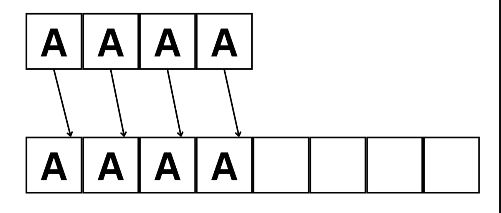

# Съдържание

## [Ключовата дума `static` в C++](#ключовата-дума-static-в-c)
1. [Какво означава `static`?](#1-какво-означава-static)
2. [Памет в C++ — Stack, Heap и Data сегмент](#2-памет-в-c--stack-heap-и-data-сегмент)
3. [`static` локална променлива](#3-static-локална-променлива)
4. [`static` глобална променлива](#4-static-глобална-променлива)
5. [`static` функция в `.cpp` файл](#5-static-функция-в-cpp-файл)
6. [`static` член-променлива на клас](#6-static-член-променлива-на-клас)
7. [`static` метод на клас](#7-static-метод-на-клас)
8. [Дизайн патърн Singleton](#8-дизайн-патърн-singleton)
9. [Edge Cases и капани](#9-edge-cases-и-капани)
10. [Обобщение](#10-обобщение)
---

## [Масиви от Обекти и Масиви от Указатели в C++](#масиви-от-обекти-и-масиви-от-указатели-в-c)
1. [Масив от обекти](#1-масив-от-обекти)
2. [Масив от указатели към обекти](#2-масив-от-указатели-към-обекти)
3. [Разлика в паметта](#3-разлика-в-паметта)
4. [Голямата четворка при клас с масив от указатели](#4-голямата-четворка-при-клас-с-масив-от-указатели)
5. [Пълен пример](#5-пълен-пример)
6. [Edge Cases и капани](#6-edge-cases-и-капани-1)
7. [Обобщение](#7-обобщение-1)
---

### 1. Какво означава `static`?

`static` е ключова дума в C++, която има **различно значение в зависимост от контекста**, в който е написана.

```
static локална променлива    → запомня стойността между извикванията
static глобална / функция    → видима само в текущия .cpp файл
static член на клас           → споделен между ВСИЧКИ обекти на класа
```

Общото между трите контекста е:

> **„Само един екземпляр за целия живот на програмата."**

---

### 2. Памет в C++ — Stack, Heap и Data сегмент

За да се разбере поведението на `static`, е необходимо да се познава как C++ организира паметта.

#### Stack (Стек)

Тук живеят **локалните променливи**. Паметта се заделя автоматично при влизане в функция и се освобождава при излизане.

```cpp
void myFunction() {
    int x = 5;        // x живее в стека
    double y = 3.14;  // y живее в стека
}   // ← x и y се унищожават тук автоматично
```

#### Heap (Купчина)

Тук живее **динамично заделената памет** (`new`). Управлява се ръчно.

```cpp
int* p = new int(42);   // заделено в heap-а
delete p;               // трябва да се освободи ръчно
```

#### Data Segment (Сегмент за данни)

Тук живеят **глобалните и `static` променливи**. Заделят се при стартиране на програмата и живеят до края й.

```
┌──────────────────────────────┐
│  Data Segment                │  ← static и глобални живеят тук
│  static int counter = 0;     │     инициализират се веднъж
├──────────────────────────────┤
│  Stack                       │  ← локални променливи
│  int x = 5;                  │     идват и си отиват
├──────────────────────────────┤
│  Heap                        │  ← new / delete
│  int* p = new int(42);       │     ръчно управление
└──────────────────────────────┘
```

`static` променливите живеят в **data сегмента** — независимо дали са декларирани в функция или в клас.

---

### 3. `static` локална променлива

#### Обикновена локална променлива

Обикновената локална променлива се **създава при всяко влизане** в функцията и се **унищожава при излизане**. При следващото извикване всичко започва от нулата.

```cpp
void counter() {
    int count = 0;   // нулира се при ВСЯКО извикване
    count++;
    std::cout << count << "\n";
}

counter();   // 1
counter();   // 1
counter();   // 1   ← никога не стига до 2
```

#### `static` локална променлива

`static` пред локална променлива означава, че тя се **инициализира само веднъж** — при първото влизане в функцията. При следващите извиквания **запазва стойността** от предишното.

```cpp
void counter() {
    static int count = 0;   // инициализира се САМО ВЕДНЪЖ
    count++;
    std::cout << count << "\n";
}

counter();   // 1
counter();   // 2
counter();   // 3   ← запомня стойността
```

#### Защо се случва това

Обикновената `count` живее в **стека** — унищожава се при всяко излизане от функцията.
`static count` живее в **data сегмента** — никога не се унищожава, но не е достъпна извън функцията.

```
Обикновена локална:             static локална:

Извикване 1:                    Извикване 1:
  Stack: count = 0                Data: count = 0
         count++ → 1                    count++ → 1
  Излизане → count изчезва       Излизане → count ОСТАВА в data

Извикване 2:                    Извикване 2:
  Stack: count = 0 (нова!)        Data: count = 1 (същата!)
         count++ → 1                    count++ → 2
```

#### Инициализацията се случва само веднъж

Ако инициализацията изисква конструктор, той се вика **само при първото влизане**:

```cpp
void createMessage() {
    static std::string msg = "Инициализирана!";  // конструкторът се вика веднъж
    std::cout << msg << "\n";
}

createMessage();   // "Инициализирана!"  ← конструкторът се вика тук
createMessage();   // "Инициализирана!"  ← само се ползва
createMessage();   // "Инициализирана!"
```

#### Практически пример — генератор на уникални ID-та

```cpp
int generateID() {
    static int nextID = 1;
    return nextID++;
}

int a = generateID();   // 1
int b = generateID();   // 2
int c = generateID();   // 3
int d = generateID();   // 4

std::cout << a << " " << b << " " << c << " " << d << "\n";
// 1 2 3 4
```

#### Практически пример — брояч на извиквания

```cpp
void processRequest() {
    static int callCount = 0;
    callCount++;
    std::cout << "Заявка #" << callCount << " обработена\n";
}

processRequest();   // Заявка #1 обработена
processRequest();   // Заявка #2 обработена
processRequest();   // Заявка #3 обработена
```

---

### 4. `static` глобална променлива

#### Обикновена глобална променлива

Глобалната променлива е видима от **всички `.cpp` файлове** в проекта чрез `extern`:

```cpp
// globals.cpp
int sharedValue = 42;    // дефиниция

// main.cpp
extern int sharedValue;  // декларация — вижда се от другия файл
sharedValue = 100;       // работи
```

#### `static` глобална променлива

`static` пред глобална променлива ограничава видимостта й само до **текущия `.cpp` файл**. Другите файлове не могат да я видят — дори и с `extern`.

```cpp
// file1.cpp
static int counter = 0;   // видима САМО в file1.cpp

// file2.cpp
extern int counter;        // ГРЕШКА при линкване!
                            // counter от file1.cpp е невидим
```

#### Защо е полезно

Предотвратява **конфликти на имена** между различни `.cpp` файлове. Два файла могат да имат `static` променлива с едно и също име без конфликт:

```cpp
// math_utils.cpp
static double pi = 3.14159;       // само за math_utils.cpp

// geometry.cpp
static double pi = 3.14159265;    // различна точност — НЯМА конфликт
```

Без `static` двете дефиниции на `pi` биха предизвикали грешка при линкване.

---

### 5. `static` функция в `.cpp` файл

`static` пред глобална функция я прави видима само в текущия `.cpp` файл. Използва се за вътрешни помощни функции, които не трябва да са достъпни от другите файлове.

```cpp
// helpers.cpp
static int doubleIt(int x) {   // само за вътрешна употреба
    return x * 2;
}

void publicFunction() {
    int result = doubleIt(5);   // OK — в същия файл
    std::cout << result << "\n";
}

// main.cpp
doubleIt(5);   // ❌ ГРЕШКА — функцията не е видима тук
```

Това е **enkapsulация на ниво файл** — детайлите на имплементацията са скрити.

---

### 6. `static` член-променлива на клас

#### Проблемът без `static`

Обикновените член-променливи са **отделни за всеки обект**. Ако е необходим брояч на всички обекти, обикновената член-променлива не помага:

```cpp
class Student {
    int objectCount;   // всеки обект има СВОЯ копие
};

Student s1, s2, s3;
// s1.objectCount, s2.objectCount, s3.objectCount са различни променливи
```

#### `static` член-променлива — едно копие за всички обекти

`static` член-променливата е **споделена между всички обекти** на класа. Съществува само **едно копие** — независимо колко обекта са създадени.

```cpp
class Student {
public:
    static int count;   // ЕДНО копие за всички обекти

    Student() { count++; }
    ~Student() { count--; }
};

// Задължително: дефиниция извън класа!
int Student::count = 0;

int main() {
    std::cout << Student::count << "\n";   // 0

    Student s1;
    Student s2;
    std::cout << Student::count << "\n";   // 2

    {
        Student s3;
        std::cout << Student::count << "\n";   // 3
    }   // s3 се унищожава тук

    std::cout << Student::count << "\n";   // 2
}
```

#### Визуализация — обикновена vs. `static` член-променлива

```
Обикновена:                           static:

s1: [ name | age | count=0 ]          s1: [ name | age ]
s2: [ name | age | count=0 ]          s2: [ name | age ]   ┐
s3: [ name | age | count=0 ]          s3: [ name | age ]   ├→ Student::count = 3
                                                             ┘
Всеки обект има своя count.           Всички споделят един count.
```

#### Дефиниция извън класа — задължително

Декларацията в тялото на класа само обявява съществуването на променливата. Реалното заделяне на памет и инициализация стават с дефиницията **извън класа** в `.cpp` файла:

```cpp
// Student.h
class Student {
public:
    static int count;   // декларация
};

// Student.cpp
int Student::count = 0;   // дефиниция — тук се заделя паметта
```

Ако дефиницията липсва, линкерът ще съобщи:

```
undefined reference to `Student::count`
```

#### Изключение — `static const` и `static constexpr`

`static const` от целочислен тип и `static constexpr` могат да се инициализират директно в тялото на класа:

```cpp
class Config {
public:
    static const int    MAX_STUDENTS = 100;      // OK — в класа
    static constexpr double PI       = 3.14159;  // OK — в класа (C++11+)
};
```

#### Достъп до `static` член-променлива

Препоръчително е достъпът да е чрез **името на класа**:

```cpp
// ✅ Препоръчително — ясно е, че е static
std::cout << Student::count;

// Работи, но подвеждащо — изглежда като обикновен член
Student s;
std::cout << s.count;   // не се препоръчва
```

---

### 7. `static` метод на клас

#### Дефиниция

`static` методът принадлежи на **класа**, а не на конкретен обект. Извиква се **без да е създаден нито един обект**.

```cpp
class MathUtils {
public:
    static int square(int x) {
        return x * x;
    }

    static double circleArea(double radius) {
        return 3.14159 * radius * radius;
    }
};

// Извикване БЕЗ обект
int s = MathUtils::square(5);           // 25
double a = MathUtils::circleArea(3.0);  // 28.27...
```

#### `static` методът няма `this` указател

Обикновеният метод получава скрит параметър `this` — указател към обекта, върху който е извикан. `static` методът **не получава `this`**, защото не е обвързан с конкретен обект.

Следствие: `static` методът **не може да достъпва нестатични членове**:

```cpp
class Example {
    int value = 10;      // нестатичен член
    static int counter;  // статичен член

public:
    static void staticMethod() {
        // std::cout << value;  ← ❌ ГРЕШКА: value е на конкретен обект,
        //                          но нямаме this
        std::cout << counter;   // ✅ OK: counter е статичен
    }

    void normalMethod() {
        std::cout << value;     // ✅ OK: имаме this
        std::cout << counter;   // ✅ OK: статичните са достъпни отвсякъде
        staticMethod();         // ✅ OK
    }
};

int Example::counter = 0;
```

#### Практически пример — брояч на обекти

```cpp
#include <iostream>
#include <string>

class Car {
    std::string brand;
    static int totalCars;      // коли в момента
    static int everCreated;    // коли изобщо

public:
    Car(const std::string& b) : brand(b) {
        totalCars++;
        everCreated++;
        std::cout << "Създадена: " << brand << "\n";
    }

    ~Car() {
        totalCars--;
        std::cout << "Унищожена: " << brand << "\n";
    }

    static void printStats() {
        std::cout << "── Статистика ──\n";
        std::cout << "Активни:        " << totalCars   << "\n";
        std::cout << "Създадени общо: " << everCreated << "\n";
        std::cout << "────────────────\n";
    }
};

int Car::totalCars   = 0;
int Car::everCreated = 0;

int main() {
    Car::printStats();      // Активни: 0 | Общо: 0

    Car bmw("BMW");
    Car audi("Audi");
    Car::printStats();      // Активни: 2 | Общо: 2

    {
        Car toyota("Toyota");
        Car::printStats();  // Активни: 3 | Общо: 3
    }   // toyota се унищожава

    Car::printStats();      // Активни: 2 | Общо: 3
}

// Изход:
// ── Статистика ──
// Активни:        0
// Създадени общо: 0
// ────────────────
// Създадена: BMW
// Създадена: Audi
// ── Статистика ──
// Активни:        2
// Създадени общо: 2
// ────────────────
// Създадена: Toyota
// ── Статистика ──
// Активни:        3
// Създадени общо: 3
// ────────────────
// Унищожена: Toyota
// ── Статистика ──
// Активни:        2
// Създадени общо: 3
// ────────────────
// Унищожена: Audi
// Унищожена: BMW
```

#### `static` методът не може да е `const`

`const` при метод означава „не модифицира `*this`". Тъй като `static` методите нямат `this`, `const` е безсмислено и компилаторът го забранява:

```cpp
class Example {
public:
    static void method() const { }   // ❌ ГРЕШКА при компилация
    static void method()       { }   // ✅ OK
};
```

---

### 8. Дизайн патърн Singleton

#### Какво е дизайн патърн?

**Дизайн патърн** е изпитано решение на често срещан проблем в програмирането. Не е конкретен код, а концепция — начин на мислене за структурирането на кода, приложим в различни ситуации.

#### Какво е Singleton?

**Singleton** е клас, от който може да съществува **точно един обект** за целия живот на програмата. Всеки опит за достъп до обекта връща **същия** вече съществуващ екземпляр.

#### Кога е нужен Singleton?

Singleton се прилага когато трябва точно едно копие на даден ресурс или услуга:

- Връзка към база данни — множество връзки са излишни и скъпи
- Системен журнал (logger) — записите трябва да се записват на едно място
- Конфигурация на приложение — трябва да е единна за всички компоненти
- Мениджър на ресурси — управлява ограничен системен ресурс

#### Проблемът без Singleton

```cpp
class Logger {
public:
    Logger() { /* отваря лог файл */ }
    void log(const std::string& msg) { /* пише в файл */ }
};

Logger log1;   // отваря файл
Logger log2;   // отваря СЪЩИЯ файл отново — конфликт!
Logger log3;   // пак!
// Три обекта пишат в един файл без координация
```

#### Имплементация с `static`

```cpp
#include <iostream>
#include <string>

class Logger {
public:
    // Единственият начин за достъп до обекта
    static Logger& getInstance() {
        static Logger instance;   // създава се само ВЕДНЪЖ
        return instance;
    }

    void log(const std::string& message) {
        std::cout << "[LOG] " << message << "\n";
    }

    void setLevel(const std::string& level) {
        logLevel = level;
    }

    std::string getLevel() const { return logLevel; }

private:
    Logger() {
        logLevel = "INFO";
        std::cout << "Logger инициализиран\n";
    }

    // Копирането е забранено — не може да съществува втори Logger
    Logger(const Logger&)            = delete;
    Logger& operator=(const Logger&) = delete;

    std::string logLevel;
};

int main() {
    // Logger log;   ← ❌ ГРЕШКА: конструкторът е private

    Logger::getInstance().log("Програмата стартира");
    Logger::getInstance().setLevel("DEBUG");

    Logger& log1 = Logger::getInstance();
    Logger& log2 = Logger::getInstance();

    log1.log("Съобщение от log1");
    log2.log("Съобщение от log2");

    std::cout << "Един и същ обект? "
              << (&log1 == &log2 ? "ДА" : "НЕ") << "\n";

    std::cout << "Ниво: " << log2.getLevel() << "\n";
}

// Изход:
// Logger инициализиран       ← само веднъж!
// [LOG] Програмата стартира
// [LOG] Съобщение от log1
// [LOG] Съобщение от log2
// Един и същ обект? ДА
// Ниво: DEBUG
```

#### Как работи `getInstance()`?

```cpp
static Logger& getInstance() {
    static Logger instance;   // ← ключовият ред
    return instance;
}
```

`static Logger instance` е `static` локална променлива:

```
Първо извикване на getInstance():
  → instance не съществува
  → Logger() се извиква → instance е конструиран
  → return instance

Второ извикване:
  → instance ВЕЧЕсъществува
  → Logger() НЕ се извиква
  → return СЪЩИЯ instance

Трето, четвърто, ... извикване:
  → същото
```

#### Thread Safety (C++11)

От C++11 инициализацията на `static` локални променливи е **гарантирано thread-safe** — стандартът гарантира, че конструкторът ще се извика точно веднъж дори при едновременен достъп от множество нишки:

```cpp
static Logger& getInstance() {
    static Logger instance;   // C++11+: thread-safe автоматично
    return instance;
}
```

#### Четирите задължителни елемента на Singleton

```cpp
class Singleton {
public:
    // 1. Публичен static метод за достъп
    static Singleton& getInstance() {
        static Singleton instance;   // 2. static локална — конструира се веднъж
        return instance;
    }

    // 3. Забраняваме копирането
    Singleton(const Singleton&)            = delete;
    Singleton& operator=(const Singleton&) = delete;

private:
    Singleton() { }   // 4. Конструкторът е private
};
```

#### Пълен пример — конфигурация на приложение

```cpp
#include <iostream>
#include <string>
#include <map>

class AppConfig {
public:
    static AppConfig& getInstance() {
        static AppConfig instance;
        return instance;
    }

    void set(const std::string& key, const std::string& value) {
        settings[key] = value;
    }

    std::string get(const std::string& key,
                    const std::string& defaultVal = "") const {
        auto it = settings.find(key);
        if (it != settings.end()) return it->second;
        return defaultVal;
    }

    void printAll() const {
        std::cout << "── Конфигурация ──\n";
        for (const auto& pair : settings)
            std::cout << pair.first << " = " << pair.second << "\n";
        std::cout << "──────────────────\n";
    }

private:
    AppConfig() {
        settings["language"] = "bg";
        settings["theme"]    = "light";
        settings["version"]  = "1.0.0";
    }

    AppConfig(const AppConfig&)            = delete;
    AppConfig& operator=(const AppConfig&) = delete;

    std::map<std::string, std::string> settings;
};

void initializeUI() {
    std::string theme = AppConfig::getInstance().get("theme");
    std::cout << "UI с тема: " << theme << "\n";
}

void loadLanguage() {
    std::string lang = AppConfig::getInstance().get("language");
    std::cout << "Език: " << lang << "\n";
}

int main() {
    AppConfig::getInstance().set("theme",    "dark");
    AppConfig::getInstance().set("language", "en");

    initializeUI();    // UI с тема: dark
    loadLanguage();    // Език: en

    AppConfig::getInstance().printAll();
}
```

#### Предимства и недостатъци

```
✅ Гарантира точно един обект
✅ Глобален достъп без глобална променлива
✅ Thread-safe в C++11 автоматично
✅ Лесна имплементация

❌ Трудно се тества — не може да се замени с mock обект
❌ Скрита зависимост — функциите зависят от него без да го декларират явно
❌ Живее до края на програмата — не може да се унищожи ранно
❌ Злоупотребата с Singleton е лоша практика
```

---

### 9. Edge Cases и капани

#### Дефиниция на `static` член извън класа — задължително

```cpp
class Counter {
public:
    static int value;
};

// ❌ Забравена дефиниция:
// Грешка при линкване: undefined reference to `Counter::value`

// ✅ Задължително в .cpp файла:
int Counter::value = 0;
```

---

#### Деструктори на `static` локални — след `main`

Деструкторите на `static` локални обекти се извикват **след края на `main`**, в обратен ред на конструкцията:

```cpp
struct Resource {
    Resource(const std::string& name) : name(name) {
        std::cout << name << " конструиран\n";
    }
    ~Resource() {
        std::cout << name << " унищожен\n";
    }
    std::string name;
};

void createA() { static Resource a("A"); }
void createB() { static Resource b("B"); }

int main() {
    createA();
    createB();
    createA();   // A вече съществува — не се конструира отново
    std::cout << "Край на main\n";
}

// Изход:
// A конструиран
// B конструиран
// Край на main
// B унищожен    ← обратен ред
// A унищожен
```

---

### Singleton — копирането трябва да е забранено

Ако копирането не е забранено изрично, може случайно да се наруши инвариантът на Singleton:

```cpp
class BadSingleton {
public:
    static BadSingleton& getInstance() {
        static BadSingleton instance;
        return instance;
    }
    // Копиращият конструктор НЕ е забранен!
};

BadSingleton& ref  = BadSingleton::getInstance();
BadSingleton copy  = ref;   // ❌ Прави копие — вече има ДВА обекта!
```

```cpp
class GoodSingleton {
public:
    static GoodSingleton& getInstance() {
        static GoodSingleton instance;
        return instance;
    }

    GoodSingleton(const GoodSingleton&)            = delete;  // ✅
    GoodSingleton& operator=(const GoodSingleton&) = delete;  // ✅

private:
    GoodSingleton() {}
};

GoodSingleton copy = GoodSingleton::getInstance();   // ❌ ГРЕШКА при компилация
```

---

### `static` не означава `const`

`static` контролира **времето на живот** и **видимостта** — не прави стойността константна:

```cpp
class Counter {
public:
    static int value;
};

int Counter::value = 0;

Counter::value = 10;    // ✅ може да се промени
Counter::value = 20;
Counter::value++;
```

За константна `static` стойност — `static const` или `static constexpr`.

---

### Static Initialization Order Fiasco

Редът, в който се инициализират `static` глобални обекти от **различни `.cpp` файлове**, е **неопределен** от стандарта:

```cpp
// file_a.cpp
int valueA = 10;

// file_b.cpp
extern int valueA;
int valueB = valueA * 2;   // ⚠️ може да е 0 или 20
                            //    зависи кой файл се инициализира пръв!
```

**Решение — Construct On First Use Idiom:**

```cpp
// file_a.cpp
int& getValueA() {
    static int value = 10;   // инициализира се при ПЪРВОТО извикване
    return value;
}

// file_b.cpp
int valueB = getValueA() * 2;   // ✅ сигурно
```

---

### Достъп до `static` член чрез обект — подвеждащо

```cpp
Car bmw("BMW");

std::cout << Car::totalCars;   // ✅ ясно — static член
std::cout << bmw.totalCars;    // ⚠️ работи, но изглежда като обикновен член
```

Препоръчва се достъп **само чрез класа**.

---

## 10. Обобщение

### Трите значения на `static`

```
┌──────────────────────────────────────────────────────────────────┐
│  Контекст              │ Значение                                │
├──────────────────────────────────────────────────────────────────┤
│  static локална        │ Инициализира се веднъж, запомня стойност│
│  static глобална       │ Видима само в текущия .cpp файл         │
│  static член на клас   │ Споделена между всички обекти           │
└──────────────────────────────────────────────────────────────────┘
```

### `static` член-променлива vs. обикновена

```
Обикновена:                             static:

s1: [ name | age | count ]              s1: [ name | age ]
s2: [ name | age | count ]              s2: [ name | age ]  → Student::count
s3: [ name | age | count ]              s3: [ name | age ]

Всеки обект има своя count.             Един count за всички.
```

### `static` метод — какво може и какво не

```
static метод:
  ✅ Извиква се без обект: ClassName::method()
  ✅ Достъпва static членове
  ✅ Може да създава обекти и да ги връща

  ❌ Няма this указател
  ❌ Не достъпва нестатични членове
  ❌ Не може да е const
```

### Singleton — структура

```cpp
class Singleton {
public:
    static Singleton& getInstance() {      // 1. публичен static метод
        static Singleton instance;          // 2. static локална — веднъж
        return instance;
    }

    Singleton(const Singleton&)            = delete;   // 3. забрана на copy
    Singleton& operator=(const Singleton&) = delete;

private:
    Singleton() { }                         // 4. private конструктор
};
```

### Правила

```
✅ static член изисква дефиниция извън класа: Type ClassName::member = val;
✅ Достъпвай static членове чрез класа: ClassName::member
✅ Singleton: private конструктор + delete copy + static getInstance()
✅ Деструкторите на static локални се викат СЛЕД main

❌ static метод не достъпва нестатични членове — няма this
❌ static не означава const
❌ Не забравяй дефиницията на static член извън класа
❌ В Singleton забрани копирането с = delete
```

> **Основен извод:** `static` управлява **времето на живот** и **видимостта** на данни. `static` локалните живеят до края на програмата и запомнят стойността между извикванията. `static` членовете на класа са споделени между всички обекти. Singleton използва тези свойства, за да гарантира точно един обект с глобален достъп за целия живот на програмата.


---

# Масиви от Обекти и Масиви от Указатели в C++

---

## Основни дефиниции

> **Масив от обекти** — наредена колекция от обекти от един и същ тип, наредени непосредствено един след друг в паметта. Всеки елемент е самостоятелен обект с автоматично управление на живота.

> **Масив от указатели** — наредена колекция от адреси, всеки от които сочи към обект в heap-а. Масивът съдържа само адреси — не самите обекти.

> **Конструктор по подразбиране** — конструктор без параметри. Необходим при `T arr[N]` и `new T[N]`, защото компилаторът трябва да конструира всеки елемент без аргументи.

> **`delete[]`** — оператор за освобождаване на динамичен масив. Извиква деструктора на всеки елемент преди да освободи паметта. Задължително се ползва вместо `delete`, когато паметта е заделена с `new[]`.

> **`nullptr`** — стойност на указател, която означава „не сочи към нищо". При масив от указатели дадена позиция може да е `nullptr`, ако обектът все още не е създаден.

> **Shallow copy** — копиране само на стойността на указателя, без данните, към които той сочи. Двата обекта споделят едни и същи данни — опасно при динамична памет.

> **Deep copy** — заделяне на нова памет и копиране на съдържанието. Двата обекта имат напълно независими копия на данните.

---

## 1. Масив от обекти

Всеки елемент е **пълноценен обект**. Конструкторите се извикват при създаването, деструкторите — при унищожаването, автоматично.

### На стека

```cpp
class Student {
    char   name[50];
    double grade;
public:
    Student() : grade(0) { name[0] = '\0'; }
    Student(const char* n, double g) : grade(g) {
        strncpy(name, n, 49); name[49] = '\0';
    }
    ~Student() { std::cout << "~Student(" << name << ")\n"; }
    void print() const { std::cout << name << " — " << grade << "\n"; }
};

Student arr[3] = {
    Student("Иван",  5.5),
    Student("Мария", 6.0),
    Student("Петър", 4.0)
};

for (int i = 0; i < 3; i++)
    arr[i].print();   // достъп с точка
// ~Student се извиква автоматично при излизане от scope
```

### На heap-а

```cpp
Student* arr = new Student[3];   // извиква Student() три пъти
arr[0] = Student("Иван",  5.5);
arr[1] = Student("Мария", 6.0);
arr[2] = Student("Петър", 4.0);

for (int i = 0; i < 3; i++)
    arr[i].print();

delete[] arr;   // задължително [] — извиква ~Student три пъти
```

### Изискване — конструктор по подразбиране

`new T[N]` и декларация `T arr[N]` без инициализатор извикват **конструктора по подразбиране** на всеки елемент. Ако го няма — грешка при компилация:

```cpp
class Car {
public:
    Car(const char* model) { /* ... */ }
    // Няма Car()!
};

Car arr[3];            // ❌ ГРЕШКА
Car* arr = new Car[3]; // ❌ ГРЕШКА
```

### Ред на конструиране и унищожаване

Конструкторите се извикват от индекс **0 нагоре**, деструкторите — в **обратен ред**:

```
Конструиране:  arr[0] → arr[1] → arr[2]
Унищожаване:   arr[2] → arr[1] → arr[0]
```

---

## 2. Масив от указатели към обекти

Масивът съдържа **адреси** на обекти — не самите обекти. Всеки обект се създава и унищожава **ръчно**.

```cpp
const int SIZE = 3;
Student* arr[SIZE];   // масив от указатели на стека

arr[0] = new Student("Иван",  5.5);
arr[1] = new Student("Мария", 6.0);
arr[2] = new Student("Петър", 4.0);

for (int i = 0; i < SIZE; i++)
    arr[i]->print();   // достъп с ->

// Задължително освобождаване — всеки обект поотделно:
for (int i = 0; i < SIZE; i++) {
    delete arr[i];
    arr[i] = nullptr;
}
```

### Динамичен масив от указатели

Когато размерът не е известен по време на компилация:

```cpp
int n;
std::cin >> n;

А** arr = new А*[n];   // масив от n указателя

for (int i = 0; i < n; i++)
    arr[i] = new Student(/* ... */);

// Освобождаване — двустепенно:
for (int i = 0; i < n; i++)
    delete arr[i];      // 1. всеки обект
delete[] arr;           // 2. масивът от указатели
```


### Предимства пред масив от обекти

- **Не изисква** конструктор по подразбиране
- Указателите могат да са `nullptr` — не всяка позиция трябва да е заета
- При сортиране се разместват само указателите — обектите не се копират
- Позволява обекти с **различни размери** (полиморфизъм)

```cpp
// Сортиране — само указателите се разменят, обектите остават на място
void sortByGrade(Student* arr[], int size) {
    for (int i = 0; i < size - 1; i++)
        for (int j = 0; j < size - i - 1; j++)
            if (arr[j]->getGrade() > arr[j+1]->getGrade())
                std::swap(arr[j], arr[j+1]);
}
```

---

## 3. Разлика в паметта

### Масив от обекти — непрекъснат блок

```
arr:
┌──────────────┬──────────────┬──────────────┐
│  Иван  | 5.5 │  Мария | 6.0 │  Петър | 4.0 │
└──────────────┴──────────────┴──────────────┘
 sizeof(Student) байта на елемент, един блок
```

### Масив от указатели — разпръснати обекти

```
arr:
┌──────┬──────┬──────┐
│  *   │  *   │  *   │   ← масивът (само адреси)
└──┼───┴──┼───┴──┼───┘
   │      │      │
   ▼      ▼      ▼
[Иван] [Мария] [Петър]    ← обектите (разпръснати в heap-а)
```

## A** vs A*

### A** - масив от указатели към обекти
Предимства:
- бърз swap
- бърз resize
- не се изисква default конструктор
- не заема излишна памет
- може да има "дупки" в масива

Недостатъци:
- няма locality


---
### Примери:
### Вариант 1
 ```c++
class A {};

A* arr = new A[n]; // def constr

int capacity = n;
int size = 0;
 ```

Създаваме масив с **capacity** от n ел-та и следим запълнените клетки чрез **size**.

Нека има следната функция за добавяне на нов обект към масива:
 ```c++
Add(const A& obj)
{
	if(size == capacity)
		resize(...);
	
	arr[size++] = obj; //op=
}
 ```
Ако решим да добавим елемент при запълнен масив, то трябва да направим нов масив и да копираме всяко А в новия масив, което ни коства ресурси.



##### Ползи:
- Locality - много по-бързо се обхождат колекции, чиито елементи са наредени последователно
- В най-добрия и средния случай (т.е когато нямаме resize) добавянето на елемент е със сложност O(1) - една стъпка

##### Недостатъци:
- Харчим много памет
- Разместването на елементи в колекцията е скъпа операция 


### Вариант 2 - указател към указатели
 ```c++
class A {};

A** ptr;
ptr = new A*[n]{nullptr};

capacity = n;
size = 0;
 ```
 


Нека има следната функция за добавяне на нов обект към масива:

 ```c++
Add(const A& obj)
{
	if(size == capacity)
		resize(...);
	
	arr[size++] = new A(obj); //copy constr
}
 ```

Ако решим да добавим елемент при запълнен масив, то в този случай няма да създаване нови обекти.


##### Ползи:
 - Бързо разместване на обектите в колекцията - не се изисква да се копират. Само разместваме указателите
 - Не се изисква същестуването на деф. контруктор на A.
 - Възможно е да имаме "празна клетка", като се възползваме от възможната nullptr стойност.

##### Недостатъци:
- Няма Locality - бавно обхождане на елементите 

### Освобождавне на ресурсите при двете реализации
- При първата:
```c++
delete[] arr;
```
- При втората:
```c++
for(int i = 0; i < size; i++)
{
	delete ptr[i]; // delete the objects
}

delete[] ptr;
```

---

## 4. Голямата четворка при клас с масив от указатели

Клас, притежаващ масив от указатели към обекти, **задължително** имплементира Голямата четворка. Автоматично генерираните версии правят shallow copy — двата обекта биха споделяли един масив.

```cpp
class Classroom {
    Student** students;
    int       count;
    int       capacity;

    void free() {
        for (int i = 0; i < count; i++)
            delete students[i];
        delete[] students;
    }

    void copyFrom(const Classroom& other) {
        capacity = other.capacity;
        count    = other.count;
        students = new Student*[capacity];
        for (int i = 0; i < count; i++)
            students[i] = new Student(*other.students[i]);
        for (int i = count; i < capacity; i++)
            students[i] = nullptr;
    }

public:
    // --- Конструктор ---
    explicit Classroom(int cap) : count(0), capacity(cap) {
        students = new Student*[capacity]();   // нулира всички указатели
    }

    // --- Деструктор ---
    ~Classroom() { free(); }

    // --- Копиращ конструктор ---
    Classroom(const Classroom& other) { copyFrom(other); }

    // --- Оператор= ---
    Classroom& operator=(const Classroom& other) {
        if (this != &other) { free(); copyFrom(other); }
        return *this;
    }

    void add(const char* name, double grade) {
        if (count < capacity)
            students[count++] = new Student(name, grade);
    }

    void print() const {
        for (int i = 0; i < count; i++)
            students[i]->print();
    }
};
```

```cpp
int main() {
    Classroom a(3);
    a.add("Иван",  5.5);
    a.add("Мария", 6.0);

    Classroom b = a;   // deep copy — b има собствени обекти
    b.add("Петър", 4.0);

    std::cout << "a:\n"; a.print();
    std::cout << "b:\n"; b.print();
}
// a:
// Иван — 5.5
// Мария — 6
// b:
// Иван — 5.5
// Мария — 6
// Петър — 4
```

---

## 5. Пълен пример

```cpp
#include <iostream>
#include <cstring>
#include <algorithm>

class Student {
    char   name[50];
    double grade;
public:
    Student() : grade(0) { name[0] = '\0'; }
    Student(const char* n, double g) : grade(g) {
        strncpy(name, n, 49); name[49] = '\0';
    }
    const char* getName()  const { return name;  }
    double      getGrade() const { return grade; }
    void print() const { std::cout << name << " — " << grade << "\n"; }
};

Student* findBest(Student* arr[], int size) {
    Student* best = nullptr;
    for (int i = 0; i < size; i++)
        if (arr[i] && (!best || arr[i]->getGrade() > best->getGrade()))
            best = arr[i];
    return best;
}

double average(Student* arr[], int size) {
    double sum = 0; int cnt = 0;
    for (int i = 0; i < size; i++)
        if (arr[i]) { sum += arr[i]->getGrade(); cnt++; }
    return cnt ? sum / cnt : 0.0;
}

int main() {
    const int SIZE = 4;

    // --- Масив от обекти ---
    std::cout << "=== Масив от обекти ===\n";
    Student objArr[SIZE] = {
        {"Иван",   5.5}, {"Мария", 6.0},
        {"Петър",  4.0}, {"Анна",  5.75}
    };
    for (int i = 0; i < SIZE; i++) objArr[i].print();

    // --- Масив от указатели ---
    std::cout << "\n=== Масив от указатели ===\n";
    Student* pArr[SIZE] = {
        new Student("Иван",  5.5),
        new Student("Мария", 6.0),
        new Student("Петър", 4.0),
        new Student("Анна",  5.75)
    };

    // Сортиране по оценка
    std::sort(pArr, pArr + SIZE, [](Student* a, Student* b) {
        return a->getGrade() > b->getGrade();
    });

    std::cout << "Сортирани по оценка:\n";
    for (int i = 0; i < SIZE; i++) pArr[i]->print();

    std::cout << "Най-добър: "; findBest(pArr, SIZE)->print();
    std::cout << "Среден успех: " << average(pArr, SIZE) << "\n";

    for (int i = 0; i < SIZE; i++) { delete pArr[i]; pArr[i] = nullptr; }
}
```

```
=== Масив от обекти ===
Иван — 5.5
Мария — 6
Петър — 4
Анна — 5.75

=== Масив от указатели ===
Сортирани по оценка:
Мария — 6
Анна — 5.75
Иван — 5.5
Петър — 4
Най-добър: Мария — 6
Среден успех: 5.3125
```

---

## 6. Edge Cases и капани

### Липсващ конструктор по подразбиране

```cpp
class Car { public: Car(const char* m) {} };

Car arr[3];             // ❌ ГРЕШКА
Car* p = new Car[3];    // ❌ ГРЕШКА

// ✅ Добави Car() {} или ползвай масив от указатели:
Car* pArr[3];
pArr[0] = new Car("BMW");
```

---

### `delete` вместо `delete[]`

```cpp
Student* arr = new Student[5];
delete arr;    // ❌ undefined behavior — деструкторите на [1..4] не се извикват
delete[] arr;  // ✅
```

---

### Забравено освобождаване на обектите

```cpp
Student* arr[3];
arr[0] = new Student("Иван", 5);
arr[1] = new Student("Мария", 6);
arr[2] = new Student("Петър", 4);
// ❌ Масивът изчезва (стек), но трите обекта в heap-а изтичат!

// ✅
for (int i = 0; i < 3; i++) { delete arr[i]; arr[i] = nullptr; }
```

---

### Дереференциране на `nullptr`

```cpp
Student* arr[3];
arr[0] = new Student("Иван", 5);
arr[1] = nullptr;
arr[1]->print();   // ❌ segfault

// ✅
for (int i = 0; i < 3; i++)
    if (arr[i]) arr[i]->print();
```

---

### Shallow copy при клас с масив от указатели

```cpp
Classroom a(3);
a.add("Иван", 5);
Classroom b = a;   // ❌ без копиращ конструктор — b.students == a.students
                    //    при ~b → delete на обектите → при ~a → double free → crash

// ✅ Имплементирай copyFrom() / free() и Голямата четворка (вж. Секция 4)
```

---

## 7. Обобщение

```
┌─────────────────────┬────────────────────┬────────────────────────────┐
│                     │  Масив от обекти   │  Масив от указатели        │
├─────────────────────┼────────────────────┼────────────────────────────┤
│ Default constructor │  Задължителен      │  Не е нужен                │
│ nullptr елементи    │  Не може           │  Може                      │
│ Достъп              │  arr[i].method()   │  arr[i]->method()          │
│ Сортиране           │  Копира обектите   │  Само адреси               │
│ Освобождаване       │  delete[] / авт.   │  delete всеки + delete[]   │
│ Памет               │  Непрекъснат блок  │  Разпръснати обекти        │
└─────────────────────┴────────────────────┴────────────────────────────┘
```

```
✅ При new[] → задължително delete[]
✅ При масив от указатели → delete всеки обект поотделно, после delete[] масива
✅ Проверявай за nullptr преди arr[i]->method()
✅ При клас с Student** → имплементирай Голямата четворка

❌ delete вместо delete[] → undefined behavior
❌ Забравено delete на обектите → memory leak
❌ Достъп до nullptr → segfault
❌ Автоматично копиране на клас с указатели → double free
```

> **Основен извод:** Масивът от обекти управлява паметта автоматично, но изисква конструктор по подразбиране. Масивът от указатели дава гъвкавост — без изискване за default constructor, с `nullptr` позиции и ефективно сортиране — но цената е ръчно управление на паметта и задължителна Голяма четворка при клас, притежаващ такъв масив.
